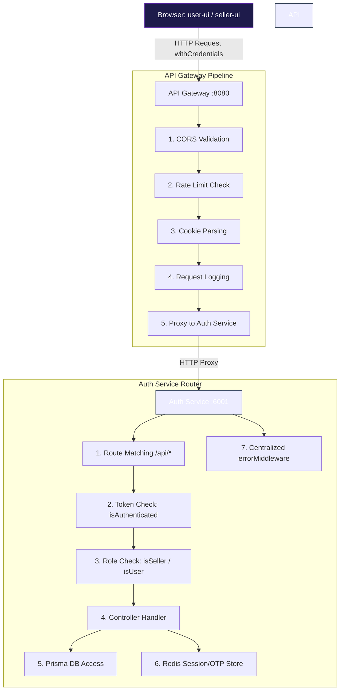
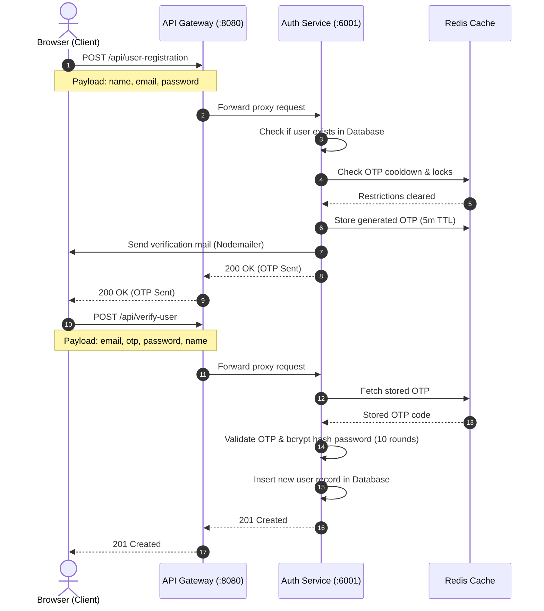

# 01 — Architecture Overview

> **Audience:** All Engineers  
> **Prerequisites:** None  
> **Related Docs:** [System Design](./02-SYSTEM-DESIGN.md) · [Dependency Graph](./11-DEPENDENCY-GRAPH.md)

---

## 1. Architecture Style

Eshop follows a **microservices-oriented monorepo** architecture using [Nx](https://nx.dev) as the build orchestrator. While the services are developed, built, and managed within a single repository, they are **independently deployable** and communicate over HTTP.

### Key Architectural Decisions

| Decision | Choice | Rationale |
|----------|--------|-----------|
| Monorepo vs Polyrepo | Monorepo (Nx) | Shared packages, atomic commits, unified CI, code reuse |
| API Communication | HTTP Proxy (Gateway → Service) | Simplicity, single entry point for clients |
| Database | MongoDB (Atlas) | Document model fits e-commerce (flexible product schemas) |
| ORM | Prisma | Type-safe queries, auto-generated client, migration support |
| Caching Layer | Redis | In-memory speed for OTP, rate-limit counters, session data |
| Frontend SSR | Next.js (App Router) | SEO, server components, file-based routing |

---

## 2. Service Topology

The system consists of **5 deployable units** organized under the `apps/` directory:

```
apps/
├── api-gateway        → Express.js reverse proxy     (Port 8080)
├── auth-service       → Express.js REST API           (Port 6001)
├── user-ui            → Next.js customer storefront   (Port 3000)
├── seller-ui          → Next.js seller dashboard      (Port 3001)
└── auth-service-e2e   → End-to-end tests for auth
```

### Service Responsibilities

#### API Gateway (`api-gateway`)
- **Role:** Single entry point for all client-side API requests
- **Technology:** Express.js + `express-http-proxy`
- **Responsibilities:**
  - CORS configuration (origin: `http://localhost:3000`)
  - API rate limiting (100 req/15min for anonymous, 1000 for authenticated)
  - Request body parsing (up to 100MB for file uploads)
  - HTTP proxying to downstream services (`http://127.0.0.1:6001`)
  - Health check endpoint (`/gateway-health`)
  - Request logging (Morgan)

#### Auth Service (`auth-service`)
- **Role:** Handles all authentication, authorization, and identity management
- **Technology:** Express.js + Prisma + Redis
- **Responsibilities:**
  - User registration (OTP-based email verification)
  - Seller registration (OTP-based with additional fields)
  - Login (User & Seller with JWT)
  - Token management (access + refresh token rotation)
  - Password recovery (forgot password → OTP → reset)
  - Shop creation and management
  - Stripe Connect integration for seller onboarding
  - Swagger API documentation (`/api-docs`)

#### User UI (`user-ui`)
- **Role:** Customer-facing e-commerce storefront
- **Technology:** Next.js 16 (App Router) + TanStack React Query
- **Responsibilities:**
  - Product browsing and search
  - User authentication flows (login, signup, forgot password)
  - Shopping cart and wishlist
  - User profile management

#### Seller UI (`seller-ui`)
- **Role:** Seller dashboard for shop and product management
- **Technology:** Next.js 16 (App Router) + Jotai + TanStack React Query
- **Responsibilities:**
  - Seller authentication flows
  - Shop creation and configuration
  - Product CRUD operations
  - Order management
  - Event and discount management
  - Stripe Connect onboarding

---

## 3. Request Lifecycle

### User-facing Request Flow



### Authentication Flow (Detailed)



---

## 4. Data Architecture

### Data Stores

| Store | Technology | Purpose | Persistence |
|-------|-----------|---------|-------------|
| Primary Database | MongoDB Atlas | Users, sellers, shops, reviews, images | Persistent |
| Cache / OTP Store | Redis (Upstash/Managed) | OTP codes, rate-limit counters, locks | Ephemeral (TTL) |

### Data Flow Patterns

1. **Write Path:** Client → Gateway → Auth Service → Prisma → MongoDB
2. **OTP Path:** Auth Service → Redis (SET with EX) → Email (Nodemailer)
3. **Read Path (Authenticated):** Client → Gateway → Auth Service → JWT verify → Prisma → MongoDB
4. **Token Refresh:** Client (401) → Axios Interceptor → `/api/refresh-token` → New Access Token in Cookie

---

## 5. Shared Package Architecture

The `packages/` directory contains reusable code shared across all services:

```
packages/
├── components/          → Shared React UI components (Input)
│   └── input/
├── error-handler/       → Custom error classes + Express error middleware
├── libs/                → Database and cache client singletons
│   ├── prisma/          → PrismaClient singleton
│   └── redis/           → ioredis singleton
└── middleware/           → Express middleware for auth/authorization
    ├── isAuthenticated.ts
    └── authorizeRoles.ts
```

These packages are imported across apps using TypeScript path aliases:
```typescript
import prisma from "@packages/libs/prisma";
import { AppError } from "@packages/error-handler";
import isAuthenticated from "@packages/middleware/isAuthenticated";
```

---

## 6. Deployment Architecture

### Current (Development)

All services run on `localhost` with different ports:

| Service | Port | Command |
|---------|------|---------|
| API Gateway | 8080 | `npx nx serve api-gateway` |
| Auth Service | 6001 | `npx nx serve auth-service` |
| User UI | 3000 | `npx nx dev user-ui` |
| Seller UI | 3001 | `npx nx dev seller-ui` |
| All Services | Mixed | `npm run dev` |

### Production-Ready (Docker)

The auth-service includes a `Dockerfile` for containerized deployment:

```dockerfile
FROM docker.io/node:lts-alpine
WORKDIR /app
COPY dist .
RUN npm --omit=dev -f install
CMD [ "node", "main.js" ]
```

Build and run:
```bash
npx nx docker:build auth-service
npx nx docker:run auth-service -p 6001:3000
```

---

## 7. Cross-Cutting Concerns

| Concern | Implementation |
|---------|---------------|
| **Logging** | Morgan (HTTP request logging in dev mode) |
| **Error Handling** | Centralized `AppError` hierarchy + Express error middleware |
| **Rate Limiting** | `express-rate-limit` (100/1000 req per 15-min window) |
| **CORS** | Explicit origin whitelist with credentials support |
| **Cookie Security** | HttpOnly, Secure (production), SameSite: Lax/None |
| **Input Validation** | Manual validation + regex (email format) |
| **API Documentation** | Swagger UI at `/api-docs` (auto-generated) |
| **Build System** | Nx with Webpack (backend) + Next.js (frontend) |
| **Type Safety** | TypeScript strict mode across all services |
| **Code Quality** | ESLint with Nx module boundary enforcement |

---

*Next: [System Design](./02-SYSTEM-DESIGN.md) for design rationale and trade-offs.*
