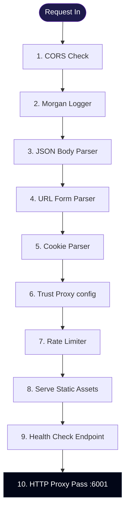
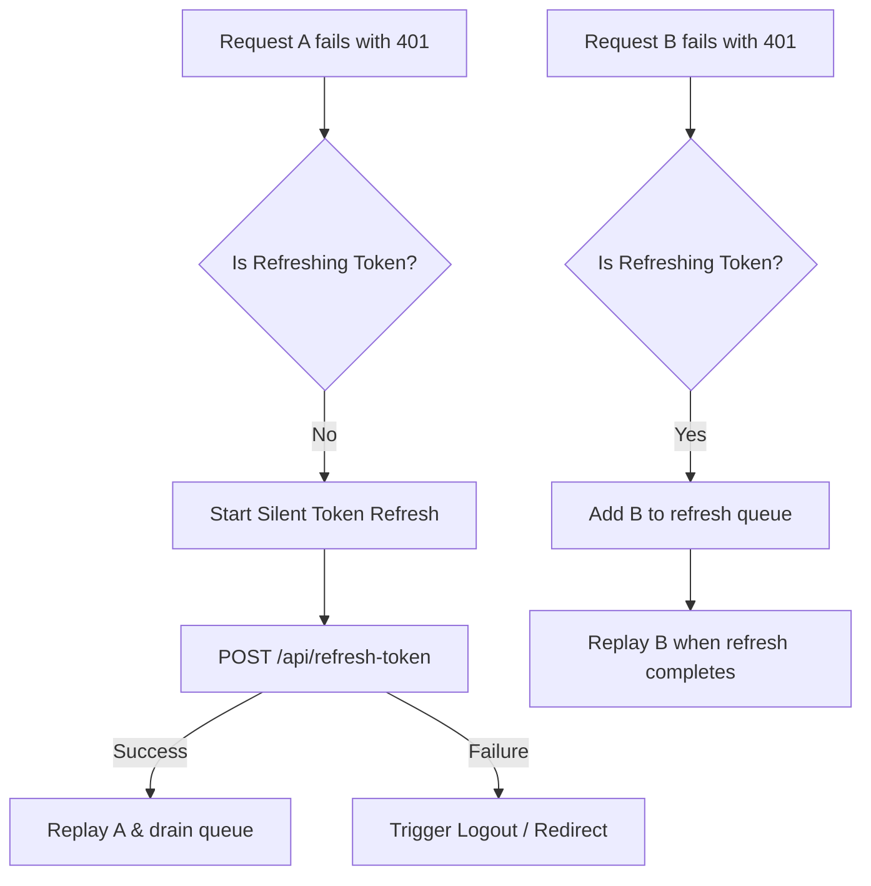
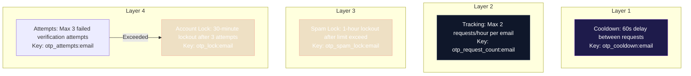
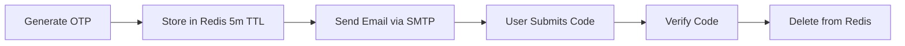
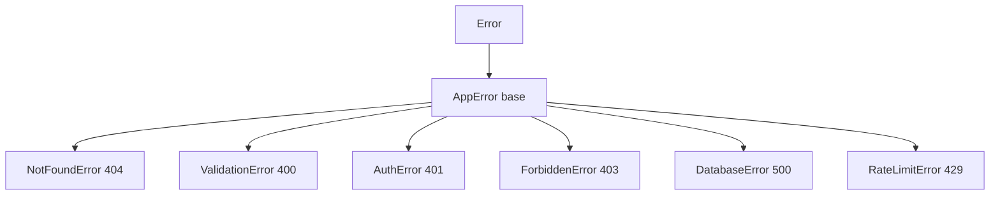
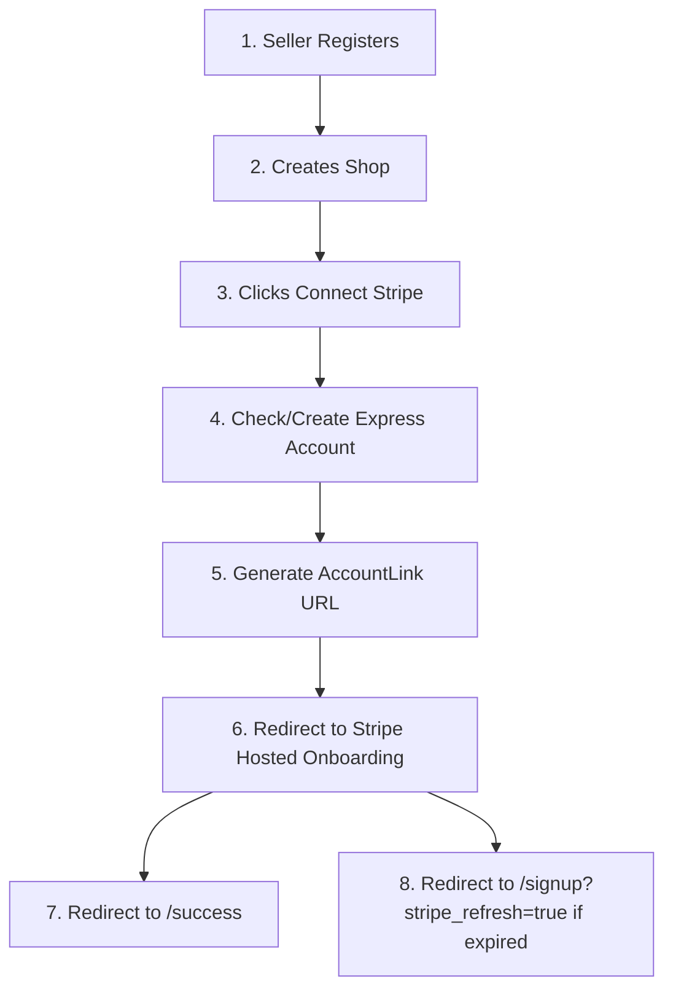

# 02 — System Design

> **Audience:** Mid → Senior Engineers, Technical Leads  
> **Prerequisites:** [Architecture Overview](./01-ARCHITECTURE.md)  
> **Related Docs:** [Design Patterns](./12-DESIGN-PATTERNS.md) · [Performance](./13-PERFORMANCE.md)

---

## 1. Design Philosophy

The Eshop platform is designed around these core principles:

| Principle | Implementation |
|-----------|---------------|
| **Separation of Concerns** | Each service owns its domain; shared logic lives in `packages/` |
| **Single Responsibility** | One service per bounded context (auth, gateway) |
| **Fail Fast** | Custom error hierarchy with centralized error middleware |
| **Defense in Depth** | Gateway rate-limiting → Auth middleware → Role guards → Validation |
| **Convention over Configuration** | Next.js App Router file-based routing, Nx project inference |
| **Type Safety** | TypeScript strict mode, Prisma-generated types, typed error classes |

---

## 2. Why a Microservices Monorepo?

### Trade-off Analysis

| Factor | Monorepo Benefit | Polyrepo Benefit | Our Choice |
|--------|-----------------|------------------|------------|
| Code Sharing | ✅ Trivial via `packages/` | ❌ Requires publishing | Monorepo |
| Atomic Changes | ✅ Single commit spans services | ❌ Multi-repo coordination | Monorepo |
| CI Complexity | ⚠️ Nx handles affected-only | ✅ Isolated pipelines | Monorepo (Nx mitigates) |
| Deploy Independence | ⚠️ Must enforce via Nx targets | ✅ Natural isolation | Monorepo (Docker per service) |
| Onboarding | ✅ One repo to clone | ❌ Multiple repos to discover | Monorepo |

### Why Nx?

Nx provides:
- **Task Graph:** Understands dependencies between projects for correct build ordering
- **Affected Commands:** Only rebuilds/retests what changed
- **Computation Caching:** Skips unchanged targets (local + remote via Nx Cloud)
- **Code Generation:** Scaffolds new apps/libs with consistent structure
- **Plugin Ecosystem:** First-class support for Express, Next.js, Jest, Docker

---

## 3. API Gateway Pattern

### Design Decision: Reverse Proxy vs. Aggregation Gateway

We chose a **simple reverse proxy** pattern:

```
Client → Gateway (8080) → Proxy all to Auth Service (6001)
```

#### Why Not an Aggregation Gateway?
- Current state has a single downstream service
- No need for request fan-out or response merging
- Keeps the gateway thin and easy to reason about

#### Future Evolution Path
As new microservices are added (e.g., product-service, order-service), the gateway should evolve:

```typescript
// Current (simple proxy)
app.use("/", proxy("http://127.0.0.1:6001"));

// Future (route-based proxy)
app.use("/api/auth", proxy("http://auth-service:6001"));
app.use("/api/products", proxy("http://product-service:6002"));
app.use("/api/orders", proxy("http://order-service:6003"));
```

### Gateway Middleware Pipeline



---

## 4. Authentication System Design

### JWT Strategy: Dual Token Pattern

| Token | Storage | TTL | Purpose |
|-------|---------|-----|---------|
| Access Token | HttpOnly Cookie | 15 minutes | Authorize API requests |
| Refresh Token | HttpOnly Cookie | 7 days | Obtain new access tokens |

### Why Cookies over Local Storage?

| Factor | Cookie (HttpOnly) | Local Storage |
|--------|-------------------|---------------|
| XSS Protection | ✅ Not accessible via JS | ❌ Vulnerable |
| CSRF Protection | ⚠️ Needs SameSite + CORS | ✅ Not auto-sent |
| SSR Compatibility | ✅ Sent automatically | ❌ Client-only |
| Our Choice | ✅ Selected | — |

### Token Payload Structure

```typescript
interface TokenPayload {
  id: string;     // MongoDB ObjectId
  role: "user" | "seller";  // Determines auth scope
}
```

### Cookie Configuration

```typescript
{
  httpOnly: true,                           // Not accessible via JavaScript
  secure: process.env.NODE_ENV === "production",  // HTTPS only in prod
  maxAge: 7 * 24 * 60 * 60 * 1000,        // 7 days
  sameSite: isProduction ? "none" : "lax",  // Cross-origin in prod
}
```

### Cookie Naming Convention

| Role | Access Token Cookie | Refresh Token Cookie |
|------|-------------------|---------------------|
| User | `accessToken` | `refreshToken` |
| Seller | `seller-access-token` | `seller-refresh-token` |

### Silent Token Refresh (Client-side)

The Axios interceptor implements a **queue-based refresh pattern** to handle concurrent 401 errors:



This prevents **thundering herd** problems where multiple failed requests each trigger their own refresh call.

---

## 5. OTP System Design

### Security Layers

The OTP system implements **4 layers of protection** against abuse:



### OTP Lifecycle



### Redis Key Schema

| Key Pattern | Value | TTL | Purpose |
|------------|-------|-----|---------|
| `otp:{email}` | 4-digit code | 5 min | Active OTP |
| `otp_cooldown:{email}` | `"true"` | 60 sec | Rate limit between requests |
| `otp_request_count:{email}` | count (int) | 1 hour | Track request frequency |
| `otp_spam_lock:{email}` | `"locked"` | 1 hour | Block excessive requesters |
| `otp_lock:{email}` | `"locked"` | 30 min | Block after failed verifications |
| `otp_attempts:{email}` | count (int) | 5 min | Track failed verification attempts |

---

## 6. Error Handling Strategy

### Error Class Hierarchy



### Error Response Contract

**Operational Error (AppError instances):**
```json
{
  "status": "error",
  "message": "User already exists with this email",
  "details": { }  // Optional, included for ValidationError
}
```

**Unhandled Error (unknown exceptions):**
```json
{
  "error": "Something went wrong, please try again later"
}
```

### Design Decision: Operational vs. Programmer Errors
- `isOperational: true` → Expected errors (validation, auth) → Return to client
- `isOperational: false` → Bugs, unhandled → Log and return generic 500

---

## 7. Multi-Tenant Design (User vs. Seller)

The system supports **two distinct user types** with separate:

| Aspect | User | Seller |
|--------|------|--------|
| Model | `users` | `sellers` |
| Registration Fields | name, email, password | name, email, password, phone, country |
| JWT Role | `"user"` | `"seller"` |
| Cookie Prefix | (none) | `seller-` |
| Frontend App | `user-ui` (:3000) | `seller-ui` (:3001) |
| Login Endpoint | `/api/login-user` | `/api/login-seller` |
| Protected Routes | `isAuthenticated + isUser` | `isAuthenticated + isSeller` |
| Additional Features | Reviews, following | Shops, products, Stripe, events |

### Login Isolation
When a user logs in, **seller cookies are explicitly cleared** (and vice versa conceptually), preventing role confusion:

```typescript
// In loginUser controller
res.clearCookie("seller-refresh-token");
res.clearCookie("seller-access-token");
```

---

## 8. Payment System Design (Stripe Connect)

### Flow: Seller Onboarding via Stripe Connect



### Stripe Integration Details

| Setting | Value |
|---------|-------|
| Account Type | Express (hosted onboarding) |
| Country | GB (United Kingdom) |
| Capabilities | Card Payments, Transfers |
| Persistence | `stripeId` stored on `sellers` model |

### Idempotency
The `createStripeConnectLink` handler is **idempotent** — if a seller already has a `stripeId`, it reuses the existing Stripe account instead of creating a new one.

---

## 9. State Management Design (Frontend)

### User UI: TanStack React Query

| Pattern | Usage |
|---------|-------|
| Server State | User session via `useUser()` hook |
| Cache Duration | 5 minutes (`staleTime`) |
| Retry | 1 attempt on failure |
| Refetch | On window focus (default) |

### Seller UI: TanStack React Query + Jotai

| Pattern | Usage |
|---------|-------|
| Server State | Seller session via `useSeller()` hook |
| Client State | Active sidebar item via Jotai atom |
| Mutations | `useMutation` for login, shop creation |

### Why Two State Libraries?

- **React Query** handles **server state** (data from API) with built-in caching, refetching, and staleness
- **Jotai** handles **client state** (UI state like sidebar selection) with atomic, bottom-up approach — lighter than Redux

---

## 10. Future Scalability Considerations

| Current State | Scaling Path |
|--------------|-------------|
| Single auth-service | Split into auth + user-profile + shop services |
| Gateway proxies all to one service | Route-based proxy to multiple services |
| No message queue | Add RabbitMQ/Kafka for async operations (emails, notifications) |
| Redis single instance | Redis Cluster for HA |
| No search | Add Elasticsearch for product search |
| No CDN | Cloudflare/CloudFront for static assets and images |
| No container orchestration | Kubernetes or AWS ECS for production |
| MongoDB single cluster | Sharding by tenant or geographic region |

---

*Next: [Database & Schema Reference](./03-DATABASE.md)*
