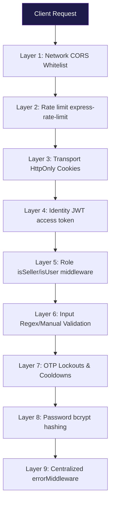
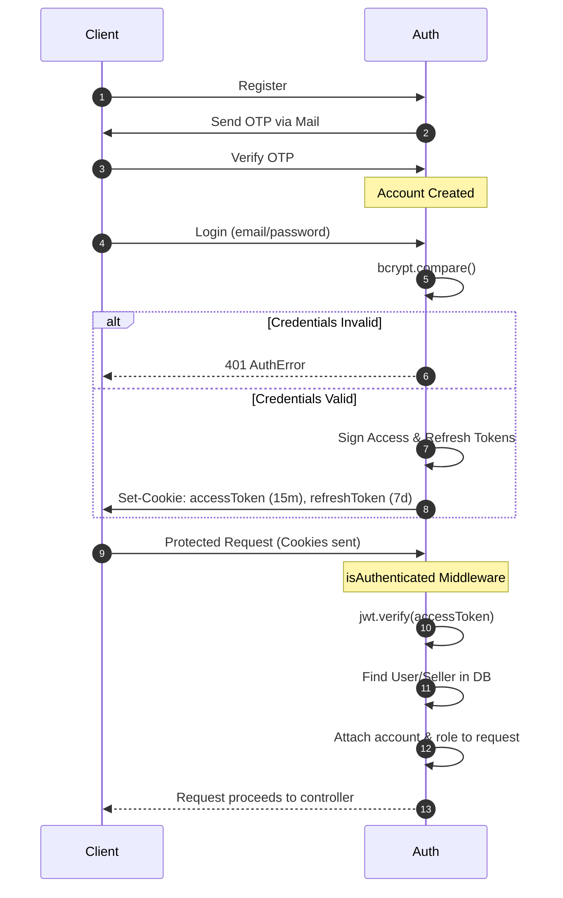

# 05 — Authentication & Security

> **Audience:** All Engineers  
> **Prerequisites:** [API Reference](./04-API-REFERENCE.md)  
> **Related Docs:** [System Design](./02-SYSTEM-DESIGN.md) · [Shared Packages](./07-SHARED-PACKAGES.md)

---

## 1. Security Architecture Overview



---

## 2. JWT Authentication Flow

### Token Lifecycle



### Token Structure

```typescript
// Access Token (signed with ACCESS_TOKEN_SECRET)
{
  id: "667a1b2c3d4e5f6789012345",   // MongoDB ObjectId
  role: "user" | "seller",           // Role discriminator
  iat: 1720248000,                   // Issued at
  exp: 1720248900                    // Expires (15 min later)
}

// Refresh Token (signed with REFRESH_TOKEN_SECRET)
{
  id: "667a1b2c3d4e5f6789012345",
  role: "user" | "seller",
  iat: 1720248000,
  exp: 1720852800                    // Expires (7 days later)
}
```

### Token Extraction Logic

The `isAuthenticated` middleware checks multiple cookie names for backward compatibility:

```typescript
const getAuthToken = (cookies, authorization) => {
  return (
    cookies["access_token"]     ||   // Legacy name
    cookies["accessToken"]      ||   // User access token
    cookies["seller-access-token"] || // Seller access token
    cookies["seller-accessToken"]  || // Legacy seller name
    authorization?.split(" ")[1]      // Bearer token fallback
  );
};
```

---

## 3. Password Security

| Property | Value |
|----------|-------|
| Algorithm | bcrypt |
| Salt Rounds | 10 |
| Library | `bcryptjs` (pure JS, no native deps) |

### Password Operations

```typescript
// Hashing (registration)
const hashedPassword = await bcrypt.hash(password, 10);

// Verification (login)
const isMatch = await bcrypt.compare(password, user.password);

// Reset protection (prevents reusing old password)
const isSamePassword = await bcrypt.compare(newPassword, user.password);
```

---

## 4. OTP Security System

### Multi-Layer Protection Matrix

| Attack Vector | Protection | Redis Key | TTL |
|--------------|-----------|-----------|-----|
| OTP Brute Force | Max 3 attempts → lock | `otp_attempts:{email}` | 5 min |
| Account Lockout | 30-min lock after failed attempts | `otp_lock:{email}` | 30 min |
| OTP Spamming | Max 2 requests/hour | `otp_request_count:{email}` | 1 hour |
| Spam Lock | 1-hour lockout | `otp_spam_lock:{email}` | 1 hour |
| Rapid Requests | 60-second cooldown | `otp_cooldown:{email}` | 60 sec |
| OTP Expiration | Auto-expire after 5 min | `otp:{email}` | 5 min |

### OTP Generation

```typescript
const otp = crypto.randomInt(1000, 9999).toString(); // 4-digit numeric
```

### Verification Flow with Attempt Tracking

```
Attempt 1 (wrong OTP):
  → otp_attempts:{email} = 1 (TTL: 5min)
  → Response: "Invalid OTP! You have 2 attempts left."

Attempt 2 (wrong OTP):
  → otp_attempts:{email} = 2
  → Response: "Invalid OTP! You have 1 attempts left."

Attempt 3 (wrong OTP):
  → otp_lock:{email} = "locked" (TTL: 30min)
  → DELETE otp:{email}, otp_attempts:{email}
  → Response: "Account locked due to multiple failed attempts!"

Attempt after lock:
  → checkOTPRestrictions() catches otp_lock
  → Response: "Account locked! Try again after 30 minutes!"
```

---

## 5. Cookie Security Configuration

### Production vs. Development

| Setting | Development | Production |
|---------|------------|------------|
| `httpOnly` | `true` | `true` |
| `secure` | `false` | `true` |
| `sameSite` | `"lax"` | `"none"` |
| `maxAge` | 7 days | 7 days |

### Cookie Names & Purpose

| Cookie | Role | Content | Lifecycle |
|--------|------|---------|-----------|
| `accessToken` | User | JWT (15min) | Set on login, refreshed silently |
| `refreshToken` | User | JWT (7 days) | Set on login, used for refresh |
| `seller-access-token` | Seller | JWT (15min) | Set on seller login |
| `seller-refresh-token` | Seller | JWT (7 days) | Set on seller login |

### Role Isolation

On user login, seller cookies are explicitly cleared:
```typescript
res.clearCookie("seller-refresh-token");
res.clearCookie("seller-access-token");
```

---

## 6. CORS Configuration

### API Gateway
```typescript
cors({
  origin: 'http://localhost:3000',        // User UI only
  credentials: true,                       // Allow cookies
  allowedHeaders: ['Content-Type', 'Authorization']
})
```

### Auth Service
```typescript
cors({
  origin: ['http://localhost:3000', 'http://localhost:6001'],
  credentials: true,
  allowedHeaders: ['Content-Type', 'Authorization']
})
```

> **Note:** The gateway CORS only allows `localhost:3000`. The seller-ui on `localhost:3001` must route through the gateway or add its origin.

---

## 7. Rate Limiting

### Configuration

```typescript
const limiter = rateLimit({
  windowMs: 15 * 60 * 1000,              // 15-minute window
  max: (req) => (req.user ? 1000 : 100), // Dynamic limit
  message: { error: 'Too many requests from this IP, please try again later' },
  standardHeaders: true,                   // RateLimit-* headers
  legacyHeaders: true,                    // X-RateLimit-* headers
});
```

### Limits

| User Type | Requests per 15 min | Response on Exceed |
|-----------|--------------------|--------------------|
| Anonymous | 100 | `429 Too Many Requests` |
| Authenticated | 1,000 | `429 Too Many Requests` |

### Headers Sent

| Header | Description |
|--------|-------------|
| `RateLimit-Limit` | Max requests in window |
| `RateLimit-Remaining` | Remaining requests |
| `RateLimit-Reset` | Time until window resets |

---

## 8. Authorization Middleware

### `isAuthenticated` Flow

```mermaid
graph TD
    Start[Request Received] --> Cookies{Extract Token}
    Cookies -->|Token Missing| Unauth[401 Unauthorized: No token]
    Cookies -->|Token Found| Verify{jwt.verify}
    Verify -->|Invalid/Expired| Invalid[401 Unauthorized: Invalid token]
    Verify -->|Valid| Role{Check role}
    Role -->|user| FetchUser[Fetch users model]
    Role -->|seller| FetchSeller[Fetch sellers model + include shop]
    FetchUser --> UserFound{Exists?}
    FetchSeller --> SellerFound{Exists?}
    UserFound -->|No| NotFound[401 Unauthorized: Account not found]
    SellerFound -->|No| NotFound
    UserFound -->|Yes| Next[next()]
    SellerFound -->|Yes| SetSeller[Set req.seller = account]
    SetSeller --> Next

    style Start fill:#1e1b4b,stroke:#4c1d95,color:#fff
    style Next fill:#020617,stroke:#1e293b,color:#fff
```

### Role Guards

```typescript
// Seller-only routes
export const isSeller = (req, res, next) => {
  if (req.role !== "seller") {
    return next(new AuthError("Forbidden! Access denied: Seller only"));
  }
  next();
};

// User-only routes
export const isUser = (req, res, next) => {
  if (req.role !== "user") {
    return next(new AuthError("Forbidden! Access denied: User only"));
  }
  next();
};
```

---

## 9. Email Security

### SMTP Configuration

| Setting | Value |
|---------|-------|
| Service | Gmail |
| Host | `smtp.gmail.com` |
| Port | 465 (SSL) |
| Authentication | App Password (not regular password) |

### Email Templates

| Template | Purpose | Triggered By |
|----------|---------|-------------|
| `user-activation-mail.ejs` | User registration OTP | `POST /api/user-registration` |
| `seller-activation-mail.ejs` | Seller registration OTP | `POST /api/seller-registration` |
| `forgot-password-user-mail.ejs` | Password reset OTP | `POST /api/forgot-password-user` |

Templates are EJS files rendered server-side with dynamic data (`name`, `otp`).

---

## 10. Security Recommendations

> **Important:** These are areas where security can be strengthened.

| Area | Current State | Recommendation |
|------|--------------|----------------|
| Input Validation | Manual checks only | Add Zod/Joi schema validation |
| CSRF Protection | SameSite cookies only | Add CSRF tokens for state-changing ops |
| Helmet Headers | Not implemented | Add `helmet` middleware for security headers |
| Request Sanitization | None | Add `express-mongo-sanitize` to prevent NoSQL injection |
| Logging | Console only | Add structured logging with sensitive data redaction |
| Secret Rotation | Static secrets | Implement periodic key rotation |
| Token Blacklisting | Not implemented | Use Redis to blacklist revoked tokens |
| Password Policy | No complexity rules | Enforce min length, complexity requirements |
| Audit Trail | Not implemented | Log authentication events to audit collection |

---

*Next: [Frontend Architecture](./06-FRONTEND.md)*
