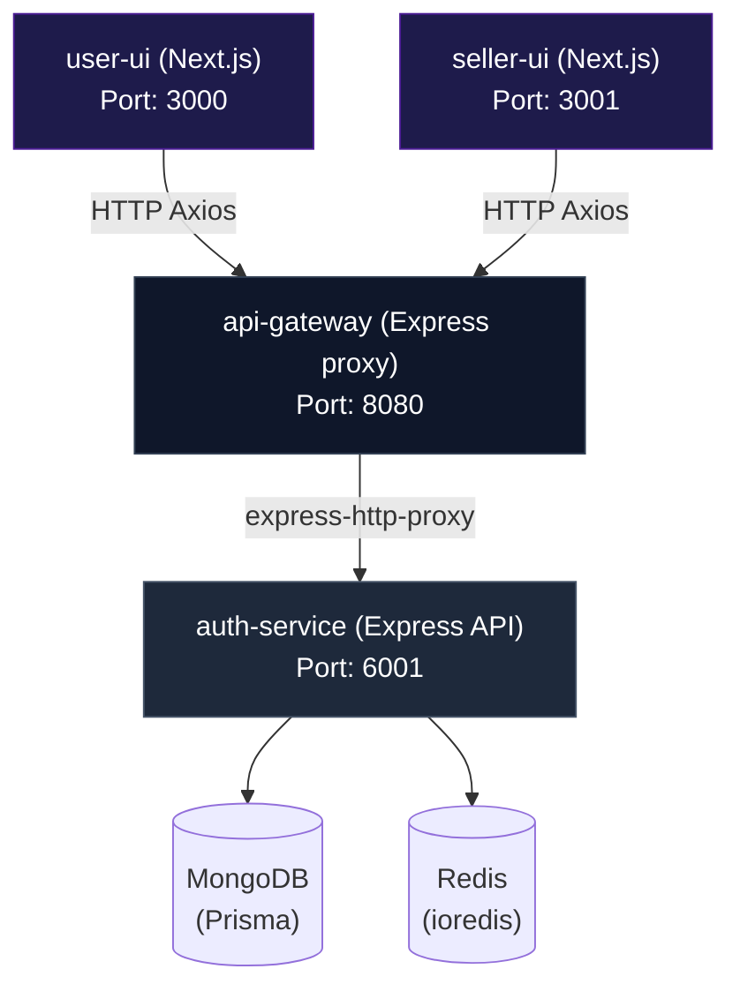
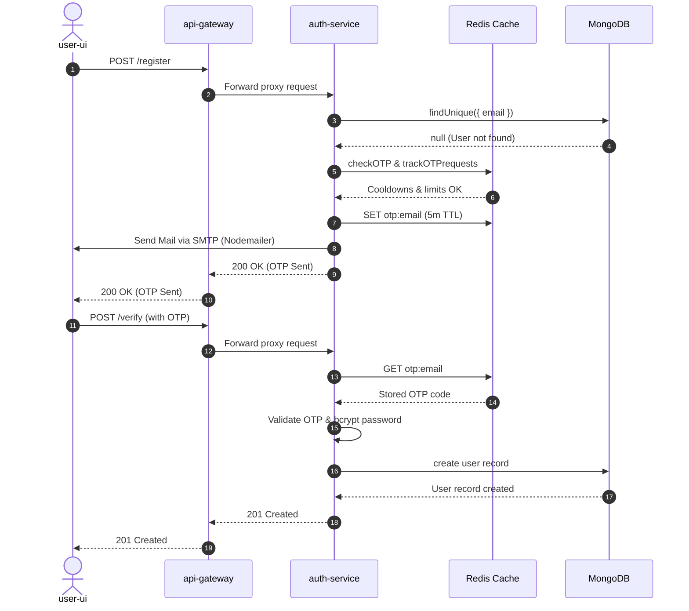
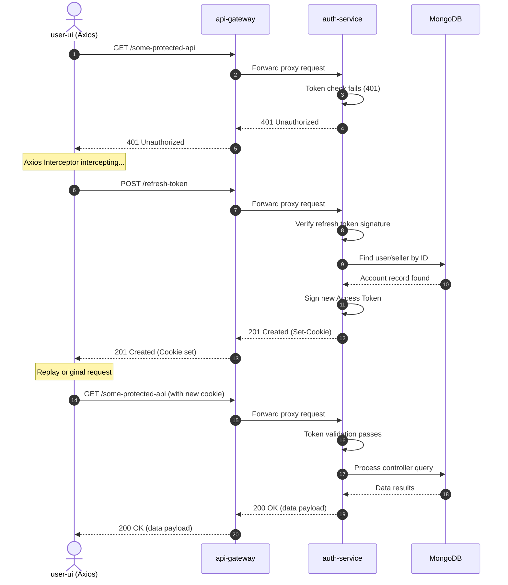

# 11 — Dependency Graph

> **Audience:** Mid → Senior Engineers  
> **Prerequisites:** [Architecture](./01-ARCHITECTURE.md) · [Shared Packages](./07-SHARED-PACKAGES.md)

---

## 1. Service Dependency Graph



---

## 2. Package Dependency Matrix

Shows which apps depend on which shared packages:

| Package | api-gateway | auth-service | user-ui | seller-ui |
|---------|:-----------:|:------------:|:-------:|:---------:|
| `@packages/error-handler` | ❌ | ✅ | ❌ | ❌ |
| `@packages/error-handler/error-middleware` | ❌ | ✅ | ❌ | ❌ |
| `@packages/libs/prisma` | ❌ | ✅ | ❌ | ❌ |
| `@packages/libs/redis` | ❌ | ✅ | ❌ | ❌ |
| `@packages/middleware/isAuthenticated` | ❌ | ✅ | ❌ | ❌ |
| `@packages/middleware/authorizeRoles` | ❌ | ✅ | ❌ | ❌ |
| `@packages/components/input` | ❌ | ❌ | ✅ | ✅ |

---

## 3. Internal Module Dependency (Auth Service)

```
main.ts
├── routes/auth.router.ts
│   ├── controller/auth.controller.ts
│   │   ├── utils/auth.helper.ts
│   │   │   ├── @packages/error-handler (ValidationError)
│   │   │   ├── @packages/libs/redis
│   │   │   ├── @packages/libs/prisma
│   │   │   └── utils/sendMail/index.ts
│   │   │       └── utils/email-templates/*.ejs
│   │   ├── utils/cookies/setCookie.ts
│   │   ├── @packages/error-handler (AppError, AuthError, ValidationError)
│   │   ├── @packages/libs/prisma
│   │   ├── bcryptjs
│   │   ├── jsonwebtoken
│   │   └── stripe
│   ├── @packages/middleware/isAuthenticated
│   │   ├── @packages/libs/prisma
│   │   └── jsonwebtoken
│   └── @packages/middleware/authorizeRoles
│       └── @packages/error-handler (AuthError)
└── @packages/error-handler/error-middleware
    └── @packages/error-handler (AppError)
```

---

## 4. NPM Dependency Categories

### Runtime Dependencies

| Package | Version | Used By | Purpose |
|---------|---------|---------|---------|
| `express` | ^4.21.2 | Gateway, Auth | HTTP server framework |
| `@prisma/client` | ^6.19.0 | Auth | Database ORM client |
| `ioredis` | ^5.10.1 | Auth | Redis client |
| `jsonwebtoken` | ^9.0.3 | Auth | JWT token signing/verification |
| `bcryptjs` | ^3.0.3 | Auth | Password hashing |
| `stripe` | ^22.3.0 | Auth | Payment processing |
| `nodemailer` | ^8.0.7 | Auth | SMTP email sending |
| `ejs` | ^5.0.2 | Auth | Email template rendering |
| `cors` | ^2.8.6 | Gateway, Auth | Cross-Origin Resource Sharing |
| `cookie-parser` | ^1.4.7 | Gateway, Auth | Cookie parsing |
| `express-http-proxy` | ^2.1.2 | Gateway | Reverse proxy |
| `express-rate-limit` | ^8.5.1 | Gateway | API rate limiting |
| `morgan` | ^1.10.1 | Gateway | HTTP request logging |
| `dotenv` | ^17.4.2 | Auth | Environment variable loading |
| `next` | ~16.1.6 | User UI, Seller UI | React framework |
| `react` | ^19.0.0 | User UI, Seller UI | UI library |
| `react-dom` | ^19.0.0 | User UI, Seller UI | React DOM renderer |
| `@tanstack/react-query` | ^5.101.0 | User UI, Seller UI | Server state management |
| `jotai` | ^2.20.1 | Seller UI | Client state management |
| `axios` | ^1.16.0 | User UI, Seller UI | HTTP client |
| `react-hook-form` | ^7.80.0 | User UI, Seller UI | Form handling |
| `react-hot-toast` | ^2.6.0 | User UI, Seller UI | Toast notifications |
| `lucide-react` | ^1.17.0 | User UI, Seller UI | Icon library |
| `styled-components` | ^6.4.3 | Seller UI | CSS-in-JS |
| `swagger-autogen` | ^2.23.7 | Auth (build) | Swagger generation |
| `swagger-ui-express` | ^5.0.1 | Auth | Swagger UI hosting |

### Dev Dependencies

| Package | Version | Purpose |
|---------|---------|---------|
| `nx` | 22.7.1 | Monorepo build system |
| `typescript` | ~5.9.2 | TypeScript compiler |
| `eslint` | ^9.8.0 | Code linting |
| `jest` | ^30.0.2 | Testing framework |
| `tailwindcss` | 3.4.3 | Utility CSS framework |
| `webpack-cli` | ^5.1.4 | Webpack CLI |
| `@swc/core` | ~1.15.5 | Fast TypeScript/JSX compiler |
| `esbuild` | ^0.27.0 | Fast JavaScript bundler |

---

## 5. Data Flow Diagrams

### User Registration Flow



### Token Refresh Flow



---

*Next: [Design Patterns](./12-DESIGN-PATTERNS.md)*
