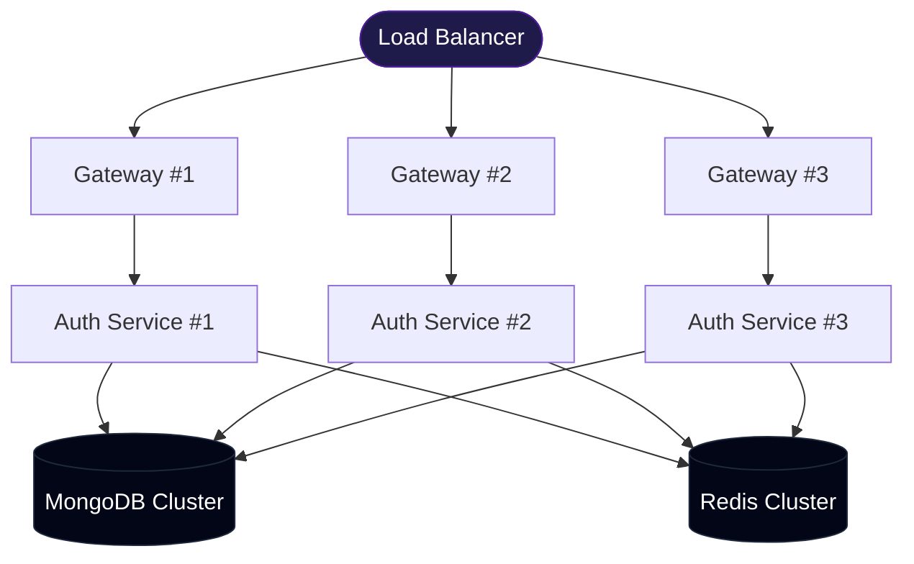

# 13 — Performance & Scalability

> **Audience:** Senior Engineers, DevOps  
> **Prerequisites:** [Architecture](./01-ARCHITECTURE.md) · [System Design](./02-SYSTEM-DESIGN.md)

---

## 1. Current Performance Profile

### Request Latency Breakdown (Typical Auth Request)

| Stage | Estimated Latency | Notes |
|-------|------------------|-------|
| Gateway CORS + parsing | ~1-2ms | In-memory operations |
| Rate limit check | ~0.5ms | In-memory counter |
| HTTP proxy overhead | ~1-3ms | Local network hop |
| JWT verification | ~1-2ms | HMAC-SHA256 |
| MongoDB query | ~5-50ms | Depends on Atlas tier and network |
| Redis GET/SET | ~1-5ms | Depends on Redis host proximity |
| bcrypt compare (login) | ~100-200ms | CPU-intensive (10 rounds) |
| Email sending | ~500-2000ms | External SMTP call |
| **Total (login)** | **~150-300ms** | Dominated by bcrypt |
| **Total (registration)** | **~600-2100ms** | Dominated by email |

---

## 2. Caching Strategy

### Current Caching Layers

| Layer | Technology | What's Cached | TTL |
|-------|-----------|--------------|-----|
| OTP Storage | Redis | OTP codes | 5 minutes |
| Rate Limit State | Redis | Request counters, locks | 60s - 1hr |
| Server State | React Query | User/seller session | 5 minutes (staleTime) |
| Static Assets | Express static | `/assets` directory | Browser defaults |
| Next.js Pages | Next.js cache | SSR/ISR pages | Framework managed |

### React Query Caching Config

```typescript
{
  staleTime: 5 * 60 * 1000,   // Data is fresh for 5 minutes
  retry: 1,                    // Retry once on failure
  refetchOnWindowFocus: true,  // Default: refetch when tab gains focus
}
```

---

## 3. Rate Limiting Details

### Gateway Level

| Parameter | Value | Purpose |
|-----------|-------|---------|
| Window | 15 minutes | Sliding window period |
| Anonymous limit | 100 requests | Protect from scraping |
| Authenticated limit | 1,000 requests | Normal user activity |
| Headers | Standard + Legacy | Client can track limits |

### OTP Level (Application)

| Protection | Limit | Lockout Duration |
|-----------|-------|-----------------|
| Request cooldown | 1 per 60 seconds | 60 seconds |
| Request count | 2 per hour | 1 hour (spam lock) |
| Failed attempts | 3 per OTP | 30 minutes (account lock) |

---

## 4. Database Performance

### Query Optimization

| Query | Index Used | Estimated Performance |
|-------|-----------|----------------------|
| `users.findUnique({ email })` | `email_unique` | O(1) — hash index |
| `sellers.findUnique({ email })` | `email_unique` | O(1) — hash index |
| `sellers.findUnique({ id }, include: shop)` | `_id` + relation | O(1) + 1 join |
| `shops.create(...)` | N/A | O(1) — insert |

### Connection Pool

Prisma maintains a default connection pool of **5 connections** for MongoDB. For high-traffic scenarios:

```typescript
const prisma = new PrismaClient({
  datasource: {
    db: {
      url: process.env.DATABASE_URL + "?maxPoolSize=20",
    },
  },
});
```

---

## 5. Scalability Assessment

### Vertical Scaling (Current Path)

| Component | Current | Can Scale To |
|-----------|---------|-------------|
| API Gateway | Single process | PM2 cluster mode (multi-core) |
| Auth Service | Single process | PM2 cluster mode |
| MongoDB | Atlas Free/Shared | Atlas M10+ (dedicated) |
| Redis | Single instance | Redis Cluster |

### Horizontal Scaling (Future Path)



### Scaling Bottlenecks

| Bottleneck | Impact | Solution |
|-----------|--------|---------|
| bcrypt hashing | CPU-bound, ~200ms | Offload to worker thread |
| SMTP sending | I/O-bound, ~1-2s | Move to message queue (async) |
| Prisma singleton | Single connection pool | Connection pooling per instance |
| No session store | JWT stored in cookies only | Add Redis session store if needed |
| Gateway CORS origin | Hardcoded single origin | Dynamic origin from env/config |

---

## 6. Optimization Recommendations

### Quick Wins (Low Effort, High Impact)

| # | Optimization | Impact | Effort |
|---|-------------|--------|--------|
| 1 | Add `compression` middleware to gateway | Reduce payload size 60-80% | Low |
| 2 | Enable Prisma query caching | Reduce DB round-trips | Low |
| 3 | Move email sending to background job | Registration response time: 2s → 50ms | Medium |
| 4 | Add `helmet` security headers | Security hardening | Low |
| 5 | Implement response caching (ETags) | Reduce bandwidth for unchanged resources | Medium |

### Medium-Term (Moderate Effort)

| # | Optimization | Impact | Effort |
|---|-------------|--------|--------|
| 6 | Split auth.controller.ts into domain controllers | Maintainability + testability | Medium |
| 7 | Add request validation with Zod schemas | Fail-fast on bad input | Medium |
| 8 | Implement structured logging (Winston/Pino) | Production debugging | Medium |
| 9 | Add health check endpoints with dependency status | Operations monitoring | Medium |
| 10 | PM2 cluster mode for Node.js processes | Multi-core utilization | Low |

### Long-Term (High Effort)

| # | Optimization | Impact | Effort |
|---|-------------|--------|--------|
| 11 | Message queue for async operations | Decouple email, notifications | High |
| 12 | CDN for static assets and images | Global latency reduction | High |
| 13 | Kubernetes deployment | Auto-scaling, self-healing | High |
| 14 | GraphQL gateway | Reduce over-fetching, BFF pattern | High |
| 15 | Elasticsearch for product search | Full-text search performance | High |

---

## 7. Monitoring Recommendations

| What to Monitor | Tool Options | Metrics |
|----------------|-------------|---------|
| API latency | Prometheus + Grafana | P50, P95, P99 response times |
| Error rates | Sentry, DataDog | Error count by type and endpoint |
| Database | MongoDB Atlas monitoring | Query time, connections, ops/sec |
| Redis | Redis CLI / Upstash dashboard | Memory, hit rate, command latency |
| Node.js | PM2 monitoring | CPU, memory, event loop lag |
| Uptime | UptimeRobot, Pingdom | Service availability |

---

*Next: [CI/CD & DevOps](./14-CICD-DEVOPS.md)*
