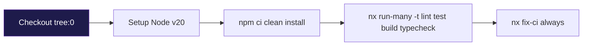
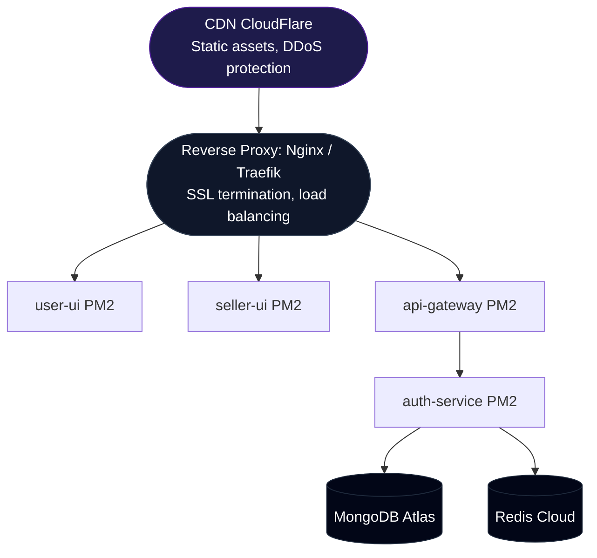

# 14 — CI/CD & DevOps

> **Audience:** DevOps, Senior Engineers  
> **Prerequisites:** [Configuration](./09-CONFIGURATION.md)

---

## 1. CI Pipeline

### GitHub Actions Workflow

**File:** `.github/workflows/ci.yml`

**Triggers:**
- Push to `master` branch
- All pull requests

**Pipeline Steps:**



### CI Tasks Explained

| Task | What It Does | Failure Means |
|------|-------------|--------------|
| `lint` | ESLint checks on all projects | Code style/quality violations |
| `test` | Jest tests on all projects | Unit test failures |
| `build` | Webpack/Next.js builds | Compilation errors |
| `typecheck` | TypeScript strict checks | Type errors |
| `fix-ci` | Nx self-healing recommendations | N/A (always runs) |

### Nx Optimization

The CI uses `npx nx run-many` which:
- **Parallel execution:** Runs independent tasks concurrently
- **Dependency-aware:** Builds dependencies before dependents
- **Caching:** Skips tasks that haven't changed (with Nx Cloud)

---

## 2. Docker Deployment

### Auth Service Dockerfile

```dockerfile
FROM docker.io/node:lts-alpine    # ~180MB base image
ENV HOST=0.0.0.0
ENV PORT=3000

WORKDIR /app
COPY dist .                        # Only build artifacts
RUN npm --omit=dev -f install      # Production deps only
CMD [ "node", "main.js" ]
```

### Build & Run Commands

```bash
# Build Docker image
npx nx docker:build auth-service

# Run container
npx nx docker:run auth-service -p 6001:3000

# Or with docker CLI
docker build -t eshop-auth -f apps/auth-service/Dockerfile apps/auth-service/
docker run -p 6001:3000 \
  -e DATABASE_URL="..." \
  -e REDIS_DATABASE_URI="..." \
  -e ACCESS_TOKEN_SECRET="..." \
  -e REFRESH_TOKEN_SECRET="..." \
  eshop-auth
```

### Multi-Stage Build (Recommended)

For production, consider a multi-stage build:

```dockerfile
# Stage 1: Build
FROM node:20-alpine AS builder
WORKDIR /app
COPY package*.json .
RUN npm ci
COPY . .
RUN npx nx build auth-service --configuration=production

# Stage 2: Run
FROM node:20-alpine
WORKDIR /app
COPY --from=builder /app/apps/auth-service/dist .
RUN npm --omit=dev install
CMD ["node", "main.js"]
```

---

## 3. Nx Build System

### Project Graph

```bash
# Visualize project dependencies
npx nx graph
```

### Affected Commands (CI Optimization)

```bash
# Only build/test affected projects (vs. base branch)
npx nx affected -t build test lint typecheck

# Affected since specific commit
npx nx affected -t build --base=HEAD~1
```

### Cache Management

```bash
# Clear local cache
npx nx reset

# Enable Nx Cloud (remote caching)
npx nx connect
```

### Build Outputs

| Project | Output Directory | Build Command |
|---------|-----------------|---------------|
| api-gateway | `apps/api-gateway/dist/` | `npx nx build api-gateway` |
| auth-service | `apps/auth-service/dist/` | `npx nx build auth-service` |
| user-ui | `apps/user-ui/.next/` | `npx nx build user-ui` |
| seller-ui | `apps/seller-ui/.next/` | `npx nx build seller-ui` |

---

## 4. Deployment Checklist

### Pre-Deployment

- [ ] All CI checks pass (lint, test, build, typecheck)
- [ ] Environment variables configured for target environment
- [ ] Database schema pushed (`npx prisma db push`)
- [ ] Prisma client generated (`npx prisma generate`)
- [ ] Stripe webhooks configured (if applicable)
- [ ] CORS origins updated for production domains
- [ ] Cookie `secure` and `sameSite` flags appropriate

### Production Environment Variables

| Variable | Dev Value | Production Value |
|----------|----------|-----------------|
| `NODE_ENV` | `development` | `production` |
| CORS origin | `http://localhost:3000` | `https://yourdomain.com` |
| Cookie secure | `false` | `true` |
| Cookie sameSite | `lax` | `none` |

---

## 5. Recommended Production Stack



---

*Next: [Troubleshooting & FAQ](./15-TROUBLESHOOTING.md)*
