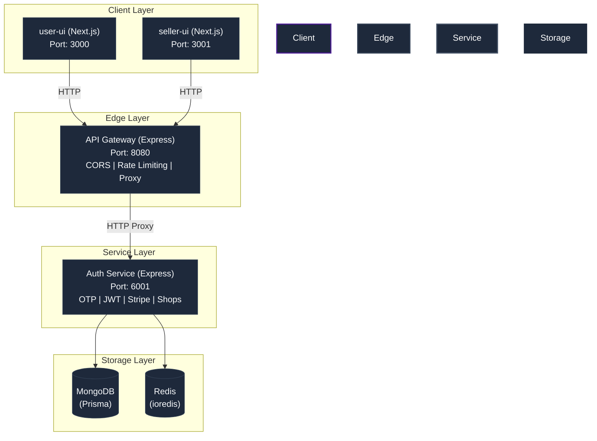

# 📚 Eshop — Technical Documentation

> **Version:** 1.0.0  
> **Last Updated:** July 2026  
> **Classification:** Internal — Engineering  
> **Audience:** Beginner → Senior Engineers, Technical Leads, DevOps, QA

---

## Purpose

This documentation serves as the **single source of truth** for the Eshop platform. It is designed to accelerate onboarding, enable knowledge transfer, and provide a reference for every layer of the system — from high-level architecture to individual function signatures.

---

## Document Index

| #  | Document | Description | Audience |
|----|----------|-------------|----------|
| 01 | [Architecture Overview](./01-ARCHITECTURE.md) | System design, service topology, data flow | All Engineers |
| 02 | [System Design](./02-SYSTEM-DESIGN.md) | Design decisions, trade-offs, scalability considerations | Mid → Senior |
| 03 | [Database & Schema Reference](./03-DATABASE.md) | Prisma schema, ERD, model relationships, indexes | All Engineers |
| 04 | [API Reference](./04-API-REFERENCE.md) | Complete REST API documentation with request/response contracts | All Engineers |
| 05 | [Authentication & Security](./05-AUTH-SECURITY.md) | JWT flow, OTP system, cookie strategy, rate limiting | All Engineers |
| 06 | [Frontend Architecture](./06-FRONTEND.md) | Next.js apps, state management, routing, components | Frontend Engineers |
| 07 | [Shared Packages](./07-SHARED-PACKAGES.md) | Monorepo packages: error-handler, middleware, libs, components | All Engineers |
| 08 | [Folder Structure & File Reference](./08-FOLDER-STRUCTURE.md) | Complete file tree with purpose annotations | All Engineers |
| 09 | [Configuration Reference](./09-CONFIGURATION.md) | Environment variables, Nx config, TypeScript, Webpack, Docker | DevOps / All Engineers |
| 10 | [Development Guide](./10-DEVELOPMENT-GUIDE.md) | Local setup, running services, debugging, testing | Beginners → Mid |
| 11 | [Dependency Graph](./11-DEPENDENCY-GRAPH.md) | Inter-service dependencies, package relationships, data flow | Mid → Senior |
| 12 | [Design Patterns](./12-DESIGN-PATTERNS.md) | Patterns used, rationale, anti-patterns to avoid | Mid → Senior |
| 13 | [Performance & Scalability](./13-PERFORMANCE.md) | Caching strategy, rate limiting, optimization opportunities | Senior / DevOps |
| 14 | [CI/CD & DevOps](./14-CICD-DEVOPS.md) | GitHub Actions, Docker, deployment pipeline | DevOps |
| 15 | [Troubleshooting & FAQ](./15-TROUBLESHOOTING.md) | Common issues, debugging runbook, known quirks | All Engineers |
| 16 | [Glossary](./16-GLOSSARY.md) | Domain terms, acronyms, technology definitions | Beginners |

---

## How to Use This Documentation

### 🟢 For Beginners (Day 1 Onboarding)
Start with: `16-GLOSSARY.md` → `08-FOLDER-STRUCTURE.md` → `10-DEVELOPMENT-GUIDE.md` → `01-ARCHITECTURE.md`

### 🟡 For Mid-Level Engineers
Start with: `01-ARCHITECTURE.md` → `04-API-REFERENCE.md` → `05-AUTH-SECURITY.md` → `06-FRONTEND.md`

### 🔴 For Senior Engineers / Leads
Start with: `02-SYSTEM-DESIGN.md` → `11-DEPENDENCY-GRAPH.md` → `12-DESIGN-PATTERNS.md` → `13-PERFORMANCE.md`

### 🔵 For DevOps Engineers
Start with: `09-CONFIGURATION.md` → `14-CICD-DEVOPS.md` → `13-PERFORMANCE.md`

---

## Tech Stack at a Glance

| Layer | Technology | Version |
|-------|-----------|---------|
| Monorepo | Nx | 22.7.1 |
| Language | TypeScript | ~5.9.2 |
| Backend Framework | Express.js | ^4.21.2 |
| Frontend Framework | Next.js | ~16.1.6 |
| UI Library | React | ^19.0.0 |
| Database | MongoDB (via Prisma) | — |
| ORM | Prisma Client | ^6.19.0 |
| Caching / OTP Store | Redis (ioredis) | ^5.10.1 |
| Payments | Stripe | ^22.3.0 |
| State Management | TanStack React Query + Jotai | ^5.101 / ^2.20 |
| Styling | Tailwind CSS + Styled Components | 3.4.3 / ^6.4.3 |
| Email | Nodemailer + EJS templates | ^8.0.7 / ^5.0.2 |
| API Docs | Swagger (swagger-autogen) | ^2.23.7 |
| Testing | Jest | ^30.0.2 |
| Build | Webpack + esbuild + SWC | Various |
| CI/CD | GitHub Actions | — |
| Containerization | Docker | — |

---

## Architecture Summary

---

*This documentation is maintained by the Engineering team. For corrections or additions, open a PR targeting the `tech-docs/` directory.*
